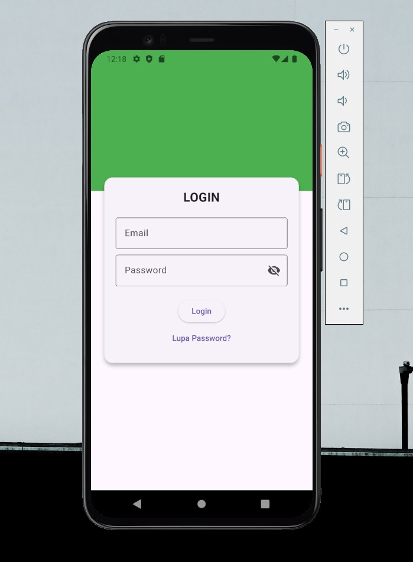
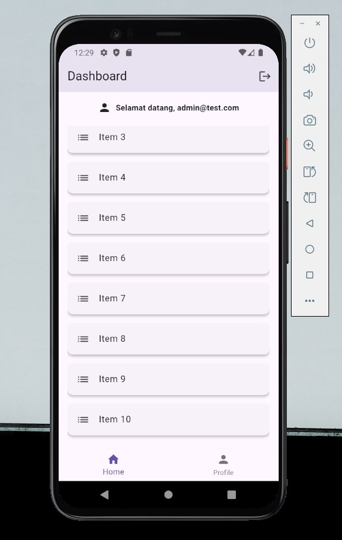
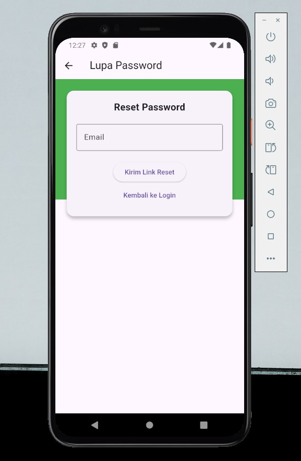

# projectuts

## Deskripsi
Aplikasi mobile sederhana menggunakan Flutter yang terdiri dari 3 halaman:
Login, Lupa Password, dan Dashboard.

## Daftar Fitur
- Login dengan validasi email & password
- Show/hide password
- Loading indicator saat login
- Snackbar feedback (error & sukses)
- Lupa Password dengan validasi email
- Dashboard menampilkan data user
- ListView dengan 10 item
- Logout kembali ke halaman login
  
## Cara Menjalankan
flutter pub get
flutter run

## Screenshot Halaman

## Daftar Package
- flutter
- cupertino_icons 
- flutter_lints 
